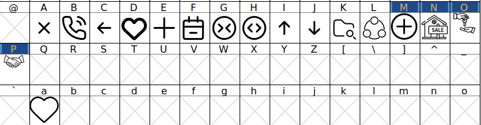

# Hamkhoone font icon
فونت آیکون‌های مورد نیاز وبسایت املاک همخونه

[](https://www.npmjs.com/package/hamkhoone-icons)


## جدول استفاده از فونت:


## طریقه استفاده در صفحات وب:

برای استفاده از فونت آیکون، ابتدا فایل css را بارگذاری نمایید
```css
@import url(hamkhoone-icons/dist/font-face.css);
```

سپس در فایل  html خود بدین صورت عمل کنید:

```html
<i class='mlk-icon'> A </i>
```
###### مثال بالا برای درج کاراکتر ضربدر (×) در فریمورک لاراول می‌باشد

## نصب

#### npm
```
npm install hamkhoone-icons --save
```
